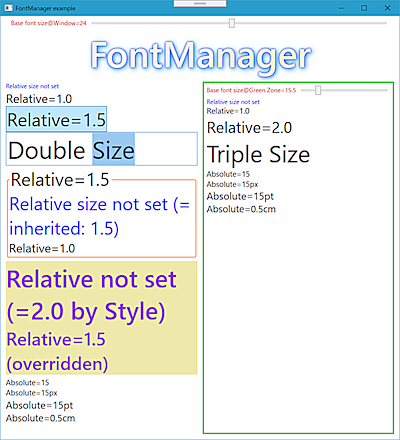
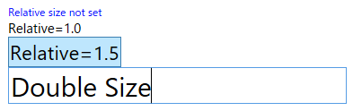

# FontManager
## [FontSize Class](./FontManager/FontSize.cs)
Allows you to describe font size by relative value when writing XAML code.  
XAML において、 相対値でフォントサイズを記述できるようにする。

<a href="./images/fig01.png" target="_blank"></a>  
([Sample Code](./SampleCore3) execution example)

### :boat: __Example__

```XML
<Window ...(omitted)...
        
        xmlns:bw="clr-namespace:BluewaterSoft.WpfUtil;assembly=BluewaterSoft.WpfUtil.FontManager"
        bw:FontSize.Base="15px"
        >
  ...(omitted)...
        <TextBlock Foreground="Blue">Relative size not set</TextBlock>
        <TextBlock bw:FontSize.Relative="1.0">Relative=1.0</TextBlock>
        <Button bw:FontSize.Relative="1.5" HorizontalAlignment="Left">Relative=1.5</Button>
        <TextBox bw:FontSize.Relative="2.0" >Double Size</TextBox>
```

The above code produces the result shown in the below image.  
上記のコードは、次の画像のような結果になります。



### :boat: __Attached Properties__

<dl>
  <dt><strong>BaseProperty</strong></dt>
  <dd>Font size on which Relative size is based. Unit symbol (px, pt, in, cm) may be added.<br />
  Relative サイズの基準となる Font サイズです。 単位記号も付記できます (px, pt, in, cm)。</dd>

  <dt><strong>RelativeProperty</strong></dt>
  <dd>Font size expressed as a magnification of the Base size.<br />
  Base サイズに対する倍率で表されるフォントサイズ。</dd>

  <dt><strong>AbsoluteProperty</strong></dt>
  <dd>Font size expressed as a real value. Same meaning as the traditional FontSize property.<br />
  実際の値で表されるフォントサイズ。本来の FontSize プロパティと同じ意味です。</dd>
</dl>

### :boat: __Limitations__

The existing FontSize property cannot be used together.  
既存の FontSize プロパティと併せて使うことはできません。
